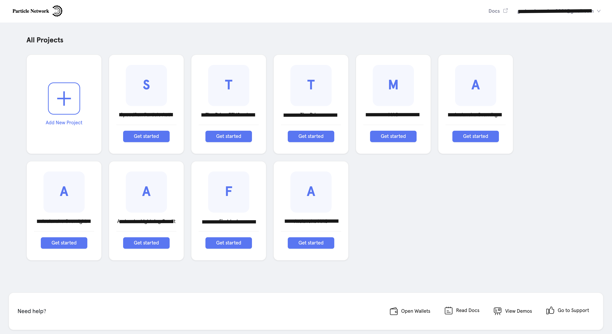
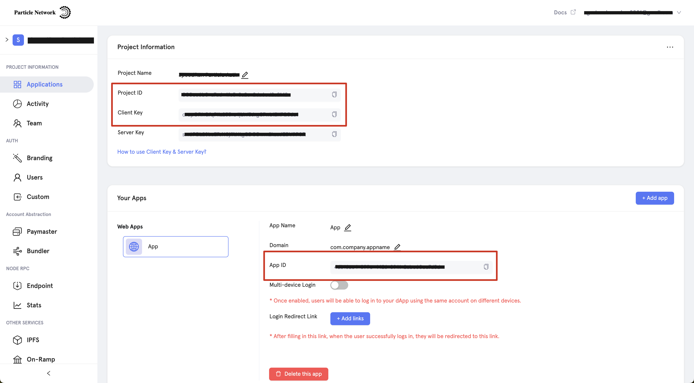
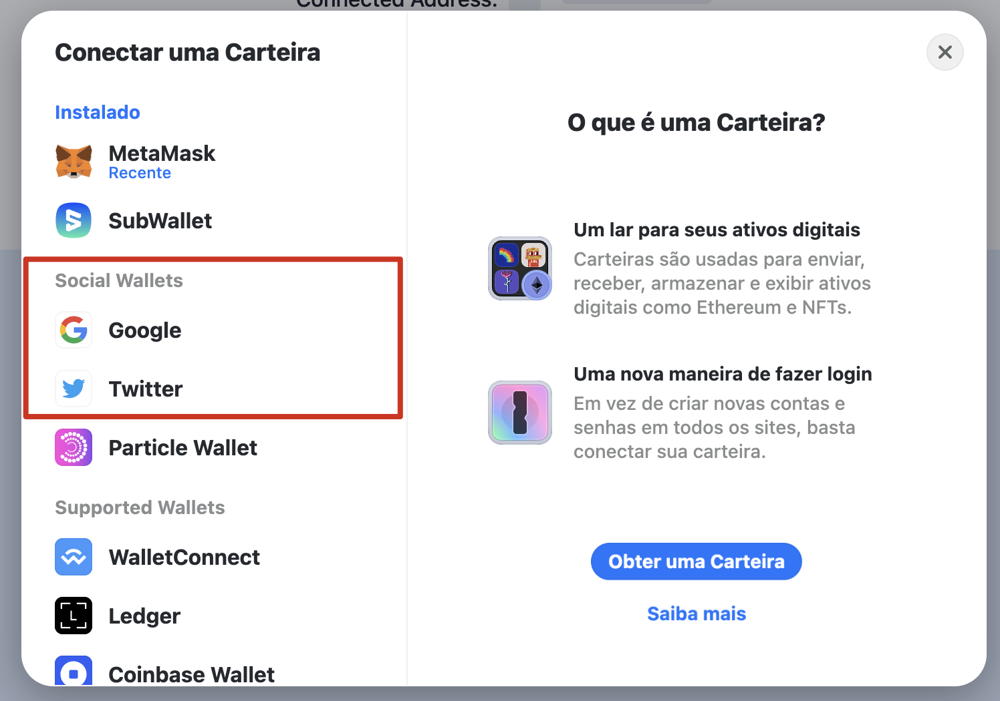
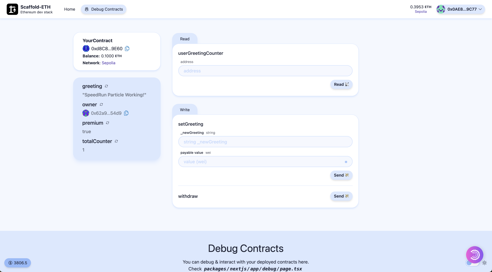

# Challenge #0: SpeedRun Particle Auth


👋 Welcome to SpeedRun Particle! This tutorial is designed for both beginners and experienced Web3 developers. Whether you are just starting out or looking to enhance your skills, this challenge will help you integrate Particle Auth into your applications.

✨ Particle Auth simplifies user authentication in Web3 apps. With support for social logins like Google and Twitter, it makes sign-ins easy and secure, improving user experience and accessibility.

## 🛠️ In this tutorial, you will:

1. Set up your development environment.
2. Configure Particle Auth for social logins.
3. Integrate Particle Auth into Scaffold ETH 2 project.
4. Create a simple smart contract.
5. Develop a frontend for user login and blockchain interaction.

🚀 By the end, you'll have a functional app with Particle Auth and blockchain interactions. Let's get started!

## Table of Contents

1. Checkpoint 0: 📦 Setting Up the Environment 📚
2. Checkpoint 1: Introduction to Scaffold ETH
3. Checkpoint 2: Create Connectors for Particle Wallet
4. Checkpoint 3: Modify the Connect Button
5. Checkpoint 4: Create a Particle Network Project
6. Checkpoint 5: Deploy the YourContract on Sepolia
7. Checkpoint 6: Interact with YourContract Using Particle Social Wallet
8. Checkpoint 7: Ship Your Frontend

---

## Checkpoint 0: 📦 Setting Up the Environment 📚

Welcome to Checkpoint 0! Before we dive into the development, we need to set up the environment. Follow these steps to get your environment ready for building the SpeedRun Particle project.

First, ensure you have Node.js and Yarn installed on your system. If you haven't installed them yet, you can download and install them from the following links:

- [Node.js](https://nodejs.org/)
- [Yarn](https://classic.yarnpkg.com/en/docs/install/)
- [Git](https://git-scm.com/)

Next, clone the starting repository for this tutorial. Open your terminal and run:

```bash
git clone https://github.com/gugasanchez/SpeedRun-Particle
cd SpeedRun-Particle
yarn install
```

In the same terminal, start your local network (a local instance of a blockchain):

```bash
yarn chain
```

in a second terminal window, 🛰 deploy your contract (locally):

```bash
cd SpeedRun-Particle
yarn deploy
```

in a third terminal window, start your 📱 frontend:

```bash
cd SpeedRun-Particle
yarn start
```

📱 Open http://localhost:3000 to see the app.

---

### Checkpoint 1: Introduction to Scaffold ETH

In this step, we will check the initial setup by interacting with the application:

1. **Connect Burner Wallet**: On the frontend, connect the burner wallet that comes with Scaffold ETH 2 (it will probably be already connected for you).
2. **Fund the Wallet**: Since the application is running on the Hardhat network, fund the wallet using the faucet button in the top right of the application.
3. **Send a Greeting**: Navigate to the "Debug Contracts" page and send a new greeting with the message "Starting SpeedRun Particle" and a value of `0.1 ETH` (100000000000000000 wei).

By completing these steps, you will ensure that your environment is correctly set up and ready for the upcoming checkpoints.

---

### Checkpoint 2: Create Connectors for Particle Wallet

In this checkpoint, we will start the development process by creating connectors for Particle Wallet. The goal is to integrate Particle Wallet into your Scaffold ETH 2 project and make it available for use in your application.

#### Step 1: Create the Particle Wallet Services

We will create two new files in the `services` directory of your project. These files will handle the integration of Particle Wallet and its connectors.

First, navigate to `packages/nextjs/services/particleWallet/` and create an `index.ts` file with the following content:

```typescript
import { googleIcon, particleIcon, twitterIcon } from "./icons";
import { particleWagmiWallet } from "./particleWagmiWallet";
import type { Wallet, WalletDetailsParams } from "@rainbow-me/rainbowkit";
import { createConnector } from "wagmi";

// Create a connector for Particle Wallet
export const particleWallet = (): Wallet => ({
  id: "particle",
  name: "Particle Wallet",
  iconUrl: async () => particleIcon,
  iconBackground: "#fff",
  installed: true,
  createConnector: (walletDetails: WalletDetailsParams) =>
    createConnector(
      config =>
        ({
          ...particleWagmiWallet()(config),
          ...walletDetails,
        } as any),
    ),
});

// Create a connector for Google using Particle Wallet
export const particleGoogleWallet = (): Wallet => ({
  id: "particle_google",
  name: "Google",
  iconUrl: async () => googleIcon,
  iconBackground: "#fff",
  installed: true,
  createConnector: (walletDetails: WalletDetailsParams) =>
    createConnector(
      config =>
        ({
          ...particleWagmiWallet({ socialType: "google" })(config),
          ...walletDetails,
        } as any),
    ),
});

// Create a connector for Twitter using Particle Wallet
export const particleTwitterWallet = (): Wallet => ({
  id: "particle_twitter",
  name: "Twitter",
  iconUrl: async () => twitterIcon,
  iconBackground: "#fff",
  installed: true,
  createConnector: (walletDetails: WalletDetailsParams) =>
    createConnector(
      config =>
        ({
          ...particleWagmiWallet({ socialType: "twitter" })(config),
          ...walletDetails,
        } as any),
    ),
});
```

In the same directory, create an `icons.ts` file with the following content:

```typescript
export const particleIcon =
  "";

export const googleIcon =
  "";

export const twitterIcon =
  "";
```

Next, we will add the Particle Wallet connectors to the `wagmiConnectors.tsx` file. This will allow the Particle Wallet options to be available in the wallet connection options.

Open the file `packages/nextjs/services/web3/wagmiConnectors.tsx` and modify it to include the Particle Wallet connectors:

```typescript
import { particleGoogleWallet, particleTwitterWallet, particleWallet } from "../particleWallet/index";
```

```typescript
    {
      groupName: "Social Wallets",
      wallets: [particleGoogleWallet, particleTwitterWallet, particleWallet],
    },
```

---

### Checkpoint 3: Modify the Connect Button

In this checkpoint, we will modify the Connect Button to handle connections with Particle Wallets. This will enable the RainbowKit to display correctly the Particle Wallets.

Navigate to `packages/nextjs/components/particle/` and create a new file named `ParticleConnectionHandler.tsx` with the following content:

```typescript
"use client";

import React, { useEffect } from "react";
import {
  AuthCoreEvent,
  type SocialAuthType,
  getLatestAuthType,
  isSocialAuthType,
  particleAuth,
} from "@particle-network/auth-core";
import { useConnect as useParticleConnect } from "@particle-network/auth-core-modal";
import { useConnect, useDisconnect } from "wagmi";
import { particleWagmiWallet } from "~~/services/particleWallet/particleWagmiWallet";

const ParticleConnectionHandler = ({ openConnectModal }: { openConnectModal: () => void }) => {
  const { connect } = useConnect();
  const { connectionStatus } = useParticleConnect();
  const { disconnect } = useDisconnect();

  useEffect(() => {
    if (connectionStatus === "connected" && isSocialAuthType(getLatestAuthType())) {
      connect({
        connector: particleWagmiWallet({ socialType: getLatestAuthType() as SocialAuthType }),
      });
    }
    const onDisconnect = () => disconnect();
    particleAuth.on(AuthCoreEvent.ParticleAuthDisconnect, onDisconnect);
    return () => particleAuth.off(AuthCoreEvent.ParticleAuthDisconnect, onDisconnect);
  }, [connect, connectionStatus, disconnect]);

  return (
    <button className="btn btn-primary btn-sm" onClick={openConnectModal} type="button">
      Connect Wallet
    </button>
  );
};

export default ParticleConnectionHandler;
```

Then, modify the existing Connect Button to use the new Particle Connection Handler.

First, open the file `packages/nextjs/components/scaffold-eth/RainbowKitCustomConnectButton/index.tsx` and add the import:

```typescript
import ParticleConnectionHandler from "~~/components/particle/ParticleConnectionHandler";
```

Next change the `!connected` case to include the new connection button:

```typescript
  if (!connected) {
    return <ParticleConnectionHandler openConnectModal={openConnectModal} />;
  }
```

---

### Checkpoint 4: Create a Particle Network Project

In this checkpoint, we will create a Particle Network project to obtain the projectId, clientKey, and appId. These keys are essential for integrating Particle Auth into your application.

Go to the [Particle Network](https://particle.network) website, press the **"Dashboard"** button in the top right, and sign up for an account if you don't already have one. If you already have an account, simply log in.

After logging in, navigate to the **"All Projects"** section from the dashboard.

Click on the **"Add New Project"** button and follow the instructions to set up a new project.



After creating the project, go to the project settings to find the Project ID, Client Key, and App ID (for the App ID, you can use a mock Url like _com.company.name_ if your application still doesn't have one).



Copy the projectId, clientKey, and appId from the settings page. We will use these keys in our application.

In your project's root directory (`packages/nextjs`), create a new file named `.env` if it doesn't already exist, and add the copied keys to the `.env` file in the following format:

```env
NEXT_PUBLIC_PROJECT_ID="your_project_id_here"
NEXT_PUBLIC_CLIENT_KEY="your_client_key_here"
NEXT_PUBLIC_APP_ID="your_app_id_here"
```

At last, open `packages/nextjs/components/ScaffoldEthAppWithProviders.tsx` and update it to include the `AuthCoreContextProvider` with the keys from the `.env` file.

```typescript
import { AuthCoreContextProvider } from "@particle-network/auth-core-modal";
```

```typescript
<AuthCoreContextProvider
  options={{
    projectId: process.env.NEXT_PUBLIC_PROJECT_ID as string,
    clientKey: process.env.NEXT_PUBLIC_CLIENT_KEY as string,
    appId: process.env.NEXT_PUBLIC_APP_ID as string,
    customStyle: {
      zIndex: 2147483650, // must greater than 2147483646
    },
  }}
>
  <WagmiProvider config={wagmiConfig}>
    <QueryClientProvider client={queryClient}>
      <ProgressBar />
      <RainbowKitProvider
        avatar={BlockieAvatar}
        theme={mounted ? (isDarkMode ? darkTheme() : lightTheme()) : lightTheme()}
      >
        <ScaffoldEthApp>{children}</ScaffoldEthApp>
      </RainbowKitProvider>
    </QueryClientProvider>
  </WagmiProvider>
</AuthCoreContextProvider>
```

---

### Checkpoint 5: Deploy the YourContract on Sepolia

In this checkpoint, we will deploy the `YourContract` smart contract to the Sepolia testnet.

Open `packages/nextjs/scaffold.config.ts` and update the `targetNetworks` to include only the Sepolia network.

```typescript
  // The networks on which your DApp is live
  targetNetworks: [chains.sepolia],
```

Change the _defaultNetwork_ in `packages/hardhat/hardhat.config.ts` to Sepolia.


🔐 Generate a deployer address with `yarn generate`. This creates a unique deployer address and saves the mnemonic locally.

This local account will deploy your contracts, allowing you to avoid entering a personal private key.

👩‍🚀 Use `yarn account` to view your deployer account balances.

⛽️ You will need to send ETH to your deployer address with your wallet, or get it from a public faucet of your chosen network.

Some popular faucets are https://sepoliafaucet.com/ and https://www.infura.io/faucet/sepolia

💬 Hint: You can set the defaultNetwork in hardhat.config.ts to sepolia OR you can yarn deploy --network sepolia.

---

### Checkpoint 6: Interact with YourContract Using Particle Social Wallet

In this checkpoint, we will interact with the `YourContract` smart contract that you deployed to the Sepolia testnet. We will use the frontend of the application and the Particle Social Wallet for this interaction.

#### Step 1: Fund Your Particle Social Wallet

1. **Connect Particle Wallet**

   On the frontend, connect to the Particle Social Wallet (e.g., Google or Twitter login) that you configured earlier.



2. **Get Sepolia ETH**

   Ensure your connected Particle wallet has Sepolia ETH. If not, use the Sepolia faucet to get testnet ETH. Visit [Sepolia Faucet](https://faucet.sepolia.dev/) and request testnet ETH for your Particle wallet address.


#### Step 2: Interact with YourContract

1. **Navigate to Debug Contracts**

   In the frontend, navigate to the "Debug Contracts" page. This page allows you to interact with the smart contracts directly.

   

2. **Interact with YourContract**

   Find the section for `YourContract` on the Debug Contracts page. Here, you can interact with the contract's functions. Perform the following actions:

   - **Send a Greeting**: Use the input fields to send a greeting message to the contract. Enter a message like "Hello from Particle Wallet" and submit the transaction.

   - **Check the Greeting**: After sending the greeting, you can check the current greeting stored in the contract. This verifies that the interaction was successful.

#### Step 3: Verify Transactions

1. **View Transactions**

   You can view the transaction details on the Sepolia testnet explorer. Go to [Sepolia Testnet Explorer](https://sepolia.etherscan.io/) and enter your wallet address to see the transactions.

   

2. **Check Contract State**

   Verify that the state of the contract has been updated according to your interactions. This ensures that the contract functions as expected.

By completing these steps, you have successfully interacted with your deployed `YourContract` smart contract using the Particle Social Wallet. This demonstrates the seamless integration of social login wallets in a Web3 application.

---

### Checkpoint 7: Ship Your Frontend

🚀 Deploy your NextJS App

```bash
yarn vercel
```

Follow the steps to deploy to Vercel. Once you log in (email, github, etc), the default options should work. It'll give you a public URL.

If you want to redeploy to the same production URL you can run `yarn vercel --prod`. If you omit the `--prod` flag it will deploy it to a preview/test URL.

⚠️ Run the automated testing function to make sure your app passes

```bash
yarn test
```

#### Configuration of Third-Party Services for Production-Grade Apps.

By default, 🏗 Scaffold-ETH 2 provides predefined API keys for popular services such as Alchemy and Etherscan. This allows you to begin developing and testing your applications more easily, avoiding the need to register for these services.
This is great to complete your SpeedRunEthereum.

For production-grade applications, it's recommended to obtain your own API keys (to prevent rate limiting issues). You can configure these at:

🔷ALCHEMY_API_KEY variable in `packages/hardhat/.env and packages/nextjs/.env.local`. You can create API keys from the Alchemy dashboard.

📃ETHERSCAN_API_KEY variable in `packages/hardhat/.env` with your generated API key. You can get your key here.

💬 Hint: It's recommended to store env's for nextjs in Vercel/system env config for live apps and use `.env.local` for local testing.

---

## Conclusion

Congratulations on completing the SpeedRun Particle tutorial! By following this guide, you've successfully integrated Particle Auth into a Scaffold ETH 2 project, enabling powerful social login capabilities. This enhancement significantly improves user experience and accessibility, demonstrating the robustness and flexibility of Scaffold ETH 2 in modern Web3 applications.

This tutorial not only equips you with the skills to integrate Particle Auth into your projects but also serves as a foundation for incorporating similar functionalities in any application using RainbowKit.

We hope you found this tutorial enriching and inspiring. This project is intended to continue with more challenges, exploring new Particle Network services and further enhancing your Web3 development skills.

A special thank you to the BuidlGuidl mentors of Batch 4 for making this project possible, Particle's Advocate Tabasco for the invaluable support, and Ryan Viana and Pedro Peres for reviewing the final version of SpeedRun Particle.

Happy building! 🚀
